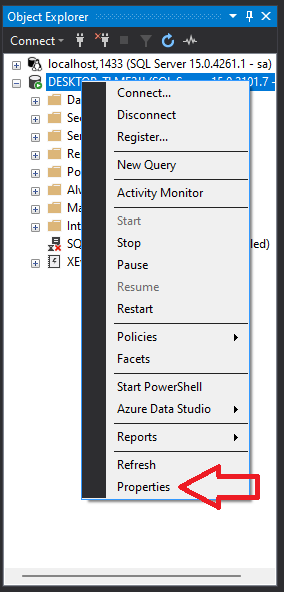

## Descripción de la Edición de SQL Server

Existe muchas maneras de ver la version del SQL server:
1. Ingresando al log (los registros de SQL server) el cual se encuentra en el siguiente paths.
    ~~~shell
    > C:\Program Files\Microsoft SQL Server\MSSQL15.MSSQLSERVER\MSSQL\Log
    ~~~
    luego abrir el archivo ERRORLOG, los cuales son los registros de errores de sql.

2. haciendo click derecho en el nombre de la base de datos e ingresando en properties:

3. Puedes realizar una consulta en SQL

~~~sql
-- visualizar la version
select @@VERSION

-- visualizar la version, producto y edición
SELECT SERVERPROPERTY('PRODUCTVERSION'),SERVERPROPERTY('PRODUCTLEVEL'),
SERVERPROPERTY('EDITION')
~~~

## Bases de Datos por Defecto

En SQL Server, existen cuatro bases de datos principales, cada una con un propósito específico:

1. **La base de datos "master":** Es la base de datos principal de SQL Server y contiene información sobre todas las demás bases de datos del servidor, incluyendo información de inicio de sesión y permisos. Además, también contiene información sobre la configuración del servidor, como los parámetros de configuración y los objetos del sistema.

2. **La base de datos "model":** Esta base de datos se utiliza como plantilla para crear nuevas bases de datos en el servidor. Cuando se crea una nueva base de datos, se utiliza la información de la base de datos "model" como punto de partida.

3. *La base de datos "tempdb":* Es una base de datos temporal que se utiliza para almacenar datos temporales y objetos de trabajo para las operaciones de SQL Server. Esto incluye tablas temporales, variables de tabla, variables de tabla de usuario, cursores y otros objetos temporales.

4. *La base de datos "msdb":* Contiene información y objetos que se utilizan para programar y administrar tareas del sistema, como la copia de seguridad y restauración de bases de datos, la programación de trabajos de SQL Server Agent y la administración de alertas.

### En resumen:
* "master": es la base de datos principal del servidor y contiene información sobre todas las demás bases de datos y configuración del servidor.
* "model": se utiliza como plantilla para crear nuevas bases de datos, 
* "tempdb": se utiliza para almacenar objetos temporales 
* "msdb": se utiliza para administrar tareas del sistema y programación de trabajos.

## Planificación de la Base de Datos

~~~sql
-- se debe tener en cuenta que los path del filename para el MDF y el LDF es referencial y puede cambiar segun la version que se disponga.

CREATE DATABASE ESCUELA
ON(
NAME='ESCUELA_DATA',
FILENAME='C:\Program Files\Microsoft SQL Server\MSSQL15.MSSQLSERVER\MSSQL\DATA\ESCUELA_DATA.MDF',
SIZE=5MB,
MAXSIZE=15MB,
FILEGROWTH=50%
)
LOG ON(
NAME='ESCUELA_LOG',
FILENAME='C:\Program Files\Microsoft SQL Server\MSSQL15.MSSQLSERVER\MSSQL\DATA\ESCUELA_LOG.LDF',
SIZE=5MB,
MAXSIZE=15MB,
FILEGROWTH=2MB
);

GO
~~~

Puede que te genere un error como este:

~~~shell
Directory lookup for the file "C:\Users\joel_\Documents\GitHub\Especializacion_SQL_Server\3. Administration\class 2\database\BD_TIENDA_DATA.MDF" failed with the operating system error 5(Acceso denegado.).
~~~
el cual no es otra cosa mas que el sql server no tiene los permisos para hacer CRUD en una carpeta,

### Los archivos .MDF y .LDF 

* **El archivo .MDF (Master Data File)** es el archivo principal de la base de datos que contiene los datos y los objetos de la base de datos, como tablas, índices, procedimientos almacenados, entre otros.

* **El archivo .LDF (Log Data File)** es el archivo de registro de transacciones que se utiliza para registrar todas las transacciones realizadas en la base de datos. Esto incluye todas las inserciones, actualizaciones y eliminaciones de datos.

### Consideraciones:
El archivo de registro de transacciones es crítico para la integridad de los datos de la base de datos, ya que se utiliza para recuperar la base de datos en caso de fallo del sistema o de una falla en la unidad de almacenamiento.

Es importante tener en cuenta que, al igual que con el archivo .MDF, el archivo .LDF también es esencial para la integridad de la base de datos. Por lo tanto, es importante realizar copias de seguridad regulares tanto del archivo .MDF como del archivo .LDF para asegurarse de que los datos estén protegidos en caso de fallas del sistema o pérdida de datos.

## FILEGROUPS

Los filegroups en SQL Server son una forma de organizar y administrar los archivos de bases de datos dentro de una instancia de SQL Server. Los filegroups permiten al administrador de la base de datos asignar objetos de base de datos a grupos específicos de archivos, lo que puede ser útil por varias razones:

1. Administración de almacenamiento: Los filegroups pueden ayudar a administrar el almacenamiento de la base de datos. Al asignar objetos de base de datos a diferentes filegroups, se puede controlar la ubicación física de los archivos y gestionar de forma más eficiente el crecimiento de la base de datos. Por ejemplo, se puede asignar una tabla o índice grande a un filegroup separado para controlar su crecimiento.

2. Administración de copias de seguridad y recuperación: Los filegroups también pueden ayudar en la administración de copias de seguridad y recuperación. Se pueden realizar copias de seguridad de un filegroup específico en lugar de realizar copias de seguridad de toda la base de datos, lo que puede ser útil para bases de datos grandes o complejas. Además, en caso de falla de hardware, es posible restaurar solo el filegroup afectado en lugar de restaurar toda la base de datos.

3. Mejora del rendimiento: Finalmente, los filegroups pueden mejorar el rendimiento de la base de datos. Al asignar objetos de base de datos a diferentes filegroups, es posible ubicarlos en discos físicos diferentes para mejorar el rendimiento de entrada/salida. Esto puede ser especialmente útil para grandes bases de datos con muchas operaciones de lectura/escritura.

En resumen, los filegroups son una herramienta útil para la administración y el rendimiento de la base de datos en SQL Server.

~~~sql
--AGREGAR FILEGROUPS A LA BD
ALTER DATABASE [BD_TIENDA] ADD FILEGROUP DATA_1
GO
ALTER DATABASE  [BD_TIENDA] ADD FILEGROUP DATA_2

USE MASTER
USE ESCUELA
USE BD_TIENDA
SELECT * FROM sys.filegroups
~~~

~~~sql
--AGREGAR ARCHIVOS SECUNDARIOS A LOS FILEGROUPS

ALTER DATABASE [BD_TIENDA]
ADD FILE(
NAME=DATA1,
FILENAME='D:\SEMANA1\DATA1.NDF',
SIZE= 1MB,
MAXSIZE=10MB,
FILEGROWTH=2MB
)TO FILEGROUP DATA_1

GO
ALTER DATABASE [BD_TIENDA]
ADD FILE(
NAME=DATA2,
FILENAME='D:\SEMANA1\DATA2.NDF',
SIZE=1MB,
MAXSIZE=10MB,
FILEGROWTH=2MB
)TO FILEGROUP DATA_2

~~~

### que son los archivos .NDF?
* Los archivos con extensión .NDF en SQL Server son archivos de datos secundarios utilizados para almacenar objetos de bases de datos en una instancia de SQL Server. Cuando se crea una base de datos en SQL Server, se crea automáticamente un archivo de datos primario (.MDF) para almacenar la mayoría de los objetos de la base de datos. Sin embargo, si se requiere más espacio de almacenamiento, se pueden agregar archivos de datos secundarios con extensión .NDF.

    Los archivos .NDF se utilizan para almacenar tablas, índices y otros objetos de base de datos que se crean después de la creación inicial de la base de datos. También se pueden utilizar para dividir los datos de una tabla o índice en varios archivos, lo que puede mejorar el rendimiento de la base de datos.

## Schema

## Que es el Schema?

* un esquema (schema en inglés) es una colección lógica de objetos de base de datos, como tablas, vistas, procedimientos almacenados, funciones y otros objetos. Los esquemas se utilizan para organizar y separar los objetos de la base de datos, lo que puede facilitar la administración y el mantenimiento de la base de datos.

    Cada objeto de base de datos en SQL Server pertenece a un esquema, incluso si no se especifica explícitamente. Por defecto, los objetos se crean en el esquema dbo (abreviatura de "base de datos propietario" en inglés), que es el esquema predeterminado en SQL Server.

    Los esquemas se pueden utilizar para agrupar objetos de la base de datos que pertenecen a diferentes usuarios o aplicaciones. Por ejemplo, un esquema puede contener todas las tablas y vistas que se utilizan para una aplicación específica, mientras que otro esquema puede contener objetos utilizados por otra aplicación. Esto puede ser útil para separar y proteger los objetos de la base de datos para diferentes usuarios o aplicaciones.

~~~sql

USE ESCUELA
GO
CREATE SCHEMA DEPARTAMENTOS
GO
CREATE SCHEMA JORNADA
GO
CREATE SCHEMA TRABAJADORES
GO
CREATE SCHEMA OBRA
GO
CREATE SCHEMA PRESUPUESTO
GO

--CONS. SCHEMAS
SELECT * FROM sys.schemas
GO

CREATE TABLE DEPARTAMENTOS.DEPAS(
CODDEP  INT PRIMARY KEY,
NOMDEP VARCHAR(20)
)
GO
CREATE TABLE JORNADA.JOR(
CODJOR INT PRIMARY KEY,
DESJOR VARCHAR(40),
COSJOR MONEY
)
GO
CREATE TABLE TRABAJADORES.TRAB(
CODTRA INT PRIMARY KEY,
NOMTRA VARCHAR(30),
APETRA VARCHAR(30),
CODJOR INT FOREIGN KEY(CODJOR) REFERENCES JORNADA.JOR,
CODDEP INT FOREIGN KEY(CODDEP) REFERENCES DEPARTAMENTOS.DEPAS
)
GO
CREATE TABLE OBRA.OBR(
CODOBR INT PRIMARY KEY,
FINOBR DATE,
RESOBR VARCHAR(20),
NOMOBR VARCHAR(30) UNIQUE,
FFIOBR DATE,
CODTRA INT FOREIGN KEY(CODTRA) REFERENCES TRABAJADORES.TRAB,
CODPRE INT FOREIGN KEY(CODPRE) REFERENCES PRESUPUESTO.PRES
)

GO 
CREATE TABLE PRESUPUESTO.PRES(
CODPRE INT PRIMARY KEY,
DESPRE VARCHAR(30),
COSPRE MONEY
)
~~~

### hacer la consulta para ver mis filegroups

* 1. primera forma
    ~~~sql

    USE master
    GO

    SELECT * FROM sys.sysdatabases
    GO

    SELECT * FROM sys.filegroups
    GO
    ~~~

2. segunda forma de consulta
    ~~~sql
    SP_HELPDB [BD_TIENDA]
    ~~~