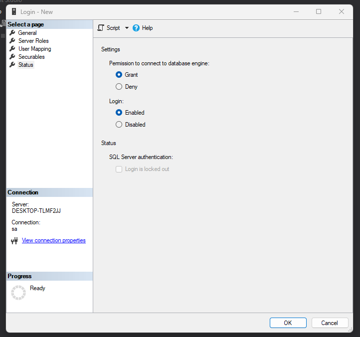
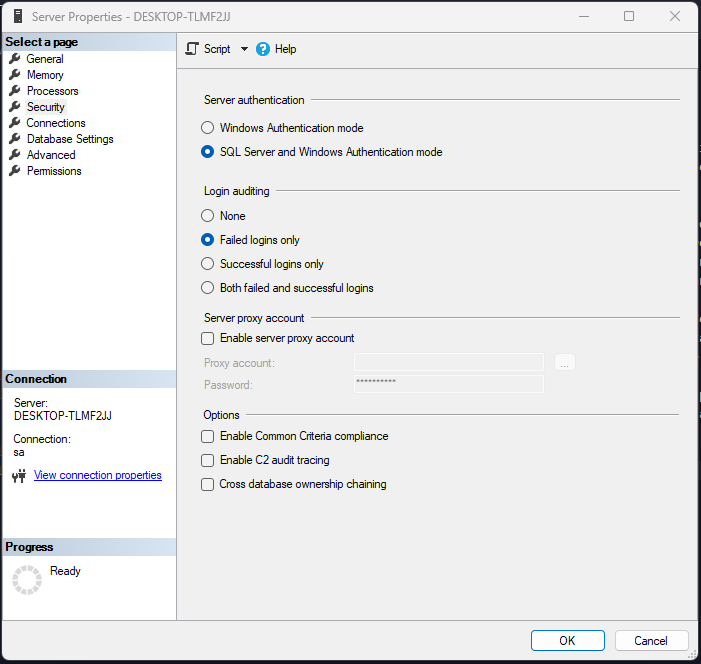
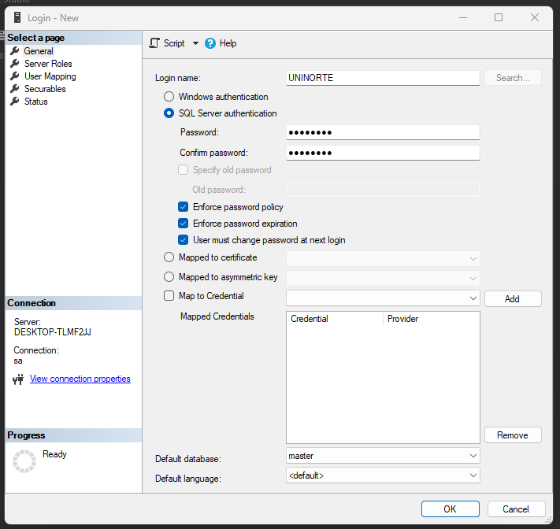

## Crear los Snapshot

En SQL Server, un snapshot es una instantánea de una base de datos en un momento específico en el tiempo. Los snapshots se utilizan para proporcionar una vista coherente y predecible de los datos en una base de datos, incluso cuando se están realizando cambios simultáneamente en la base de datos.

Cuando se crea un snapshot de una base de datos, se copia la estructura de la base de datos y los datos actuales en un archivo de instantánea separado. A partir de ese momento, los cambios realizados en la base de datos original no se reflejan en el archivo de instantánea. En cambio, los cambios se registran en un registro de cambios diferencial que se utiliza para mantener la coherencia de los datos en el archivo de instantánea.

Los snapshots son útiles en situaciones en las que se necesitan informes o consultas de datos históricos que no deben verse afectados por los cambios actuales en la base de datos. Los snapshots también se utilizan para proporcionar una opción de recuperación en caso de que se produzca un error en la base de datos original.

Es importante tener en cuenta que los snapshots consumen espacio en disco adicional y pueden afectar el rendimiento del sistema si se utilizan en exceso. Por lo tanto, es recomendable utilizar los snapshots con precaución y supervisar regularmente su impacto en el sistema.

## Roles en las bases de Datos

Antes que todo, tener las siguientes configuraciones y dar aceptar:

* expadir la carpeta security del servidor >> hacer click derecho en logins >> New login 

* hacer click derecho en el servidor >> properties >> ir al apartado de Security  

* Crearemos un nuevo usuario, click derecho a login >> new user >> agregar los datos como se muestra en la imagen
    Name: UNINORTE
    Password: Da123456

* para logear, simplemente hacer click en el enchufe y luego logearse

