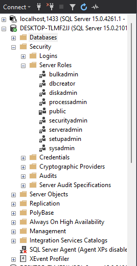
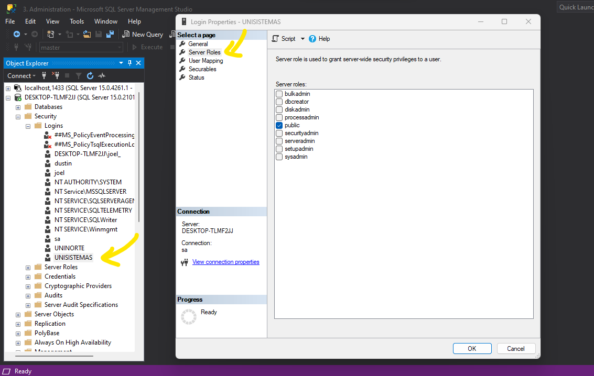

## Roles de Servidor sql server

SQL Server es un sistema de gestión de bases de datos relacionales que cuenta con varios roles de servidor para administrar y controlar la seguridad, los recursos y las operaciones en un servidor de SQL Server. A continuación se describen los 9 roles de servidor de SQL Server y sus usos:

* Sysadmin: Este es el rol de servidor más alto en SQL Server y permite a los usuarios realizar cualquier tarea en el servidor, incluyendo la creación de bases de datos, la configuración de seguridad y el mantenimiento de la instancia.

* Securityadmin: Este rol permite a los usuarios administrar la seguridad en SQL Server, como la creación de usuarios y roles, la configuración de permisos y la administración de claves de cifrado.

* Serveradmin: Este rol permite a los usuarios administrar la configuración del servidor, como la configuración de memoria, la configuración de red y la configuración del servidor de correo electrónico.

* Setupadmin: Este rol permite a los usuarios instalar y configurar SQL Server en el servidor.

* Processadmin: Este rol permite a los usuarios administrar los procesos en SQL Server, como la detención y reinicio de servicios y la administración de trabajos.

* Diskadmin: Este rol permite a los usuarios administrar los archivos y discos en SQL Server, como la creación y eliminación de archivos de bases de datos y la asignación de espacio en disco.

* Dbcreator: Este rol permite a los usuarios crear bases de datos en SQL Server.

* Bulkadmin: Este rol permite a los usuarios realizar operaciones de importación y exportación masiva de datos en SQL Server.

* Controlador de dominio: Este rol permite a los usuarios administrar y autenticar usuarios y grupos en un dominio de Active Directory.

Es importante asignar roles de servidor cuidadosamente para garantizar la seguridad y el rendimiento óptimo del servidor de SQL Server.

### lo siguiente son los roles que aparacen en Security >> server roles

### como dar permisos usando la UI

* ir a security >> Logins >> new user >> click derecho >> properties >> Server Roles >> check what user you would use

