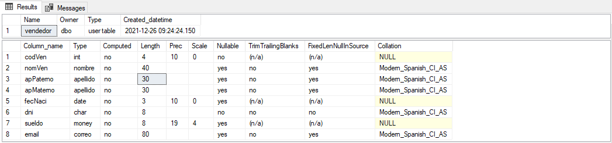

# Implementacion SQL Server

<u>By Joel Barrantes</u>

## <center><u>Indice</u></center>
#### Semana 1
1. [Instalacion](#1-instalación)
2. [Comandos Introductorios](#2-comandos-introductorios)

#### Semana 2
3. [Schemas](#3-schemas)
4. [Transact-SQL](#4-transact-sql)

<br>
<br>
<br>
<br>
<br>
<br>
<br>
<br>
<br>
<br>
<br>
<br>
<br>


#### Anexo:
this part will in the final section, by now it will be here
if you wanna get more about sql, just click on the next links

#### <a href="https://towardsdatascience.com/10-best-practices-to-write-readable-and-maintainable-sql-code-427f6bb98208">Best Practices to Write Readable and Maintainable SQL Code</a>

#### <a href="https://www.w3schools.com/sql/">SQL reference</a>

#### <a href="https://docs.microsoft.com/en-us/sql/sql-server/?view=sql-server-ver15">SQL server Documentation</a>


<div style="page-break-after: always;"></div>


# 1. Instalación

Usar el siguiente link para instalar SQL Server (Desarrollador):
> [link de pagina](https://www.microsoft.com/es-es/sql-server/sql-server-downloads)

Usar el siguiente link para instalar SQL Server Management Studio (SSMS)

> [link de pagina](https://docs.microsoft.com/es-es/sql/ssms/download-sql-server-management-studio-ssms?redirectedfrom=MSDN&view=sql-server-ver15)

# 2. Comandos introductorios

## Primeros pasos

```sql
--quien soy???
SELECT suser_sname();

--A que servidor estoy conectado???
SELECT @@SERVERNAME;

--Cual es la fecha y hora del servidor??
SELECT GETDATE();

--Con que version estoy trabajando???
SELECT @@VERSION;

--Microsoft SQL Server 2017 (RTM) - 14.0.1000.169 (X64)   
--Aug 22 2017 17:04:49   Copyright (C) 2017 Microsoft Corporation  
--Developer Edition (64-bit) on Windows Server 2012 R2 Standard 6.3 <X64> (Build 9600: ) 
--(Hypervisor) 

-- que BDs existen en el servidor???
SELECT * FROM sys.databases

--master --> info del servidor, BDs
--tempdb --> administrar Colas de Espera
--model  --> plantilla para la creacion de BD
--msdb   --> JOBs, backups realizados
```
<div style="page-break-after: always;"></div>

## Creando una Base de Datos
1. Primera Forma 

```SQL
--Creando una Base de datos
CREATE DATABASE UNI00 ;

--Vista de lista de Base de Datos
SELECT * FROM sys.databases;

--muestra la informacion de una base de satos especificada 
o de todas las base de datos sino se especifica ninguna base de datos
EXEC sp_helpdb UNI00;
```

1. Segunda Forma

* **size**: es el tamaño minimo del archivo de datos
* **maxsize**: es el tamaño maximo del archivo de datos
*  **filegrowth**: es el facto de crecimiento, puede ser en **MB** o **%**  (tener en cuenta que el crecimiento es de forma aritmetica)

```SQL
USE MASTER

IF EXISTS (SELECT NAME FROM sys.databases WHERE NAME='UNI00')
	DROP DATABASE UNI00

CREATE DATABASE UNI00
ON (name=UNI00_data, filename='c:\disco1\UNI00_data.mdf',
	SIZE=10, maxsize=unlimited, filegrowth=10)
LOG ON(name=UNI00_log, filename='c:\disco2\UNI00_log.ldf',
	size=7, maxsize=300, filegrowth=50%)

--validando la base de datos creada
EXEC sp_helpdb UNI00
```

**Archivos Maestros de Bases de Datos (Master Database Files o MDF):** guarda los datos (extension **.mdf**)

**Archivos de Registros de Bases de Datos (Log Database Files o LDF):** guarda las transacciones (extension **.ldf**)

[comment]: <> (BREAK THE PAGE)
<div style="page-break-after: always;"></div>


## Antes de Todo debemos ingresar a la base de datos

Se debe poner en modo de uso la base de datos
```SQL
-- ingresar a la BD
USE UNI00

--validando que base de datos estamos usando
SELECT db_name();
```
## Creando Tablas en nuestra Base de Datos

```sql
--usando otros tipo de datos
CREATE TABLE Persona (
	codPer INT IDENTITY PRIMARY KEY,
	nomPer VARCHAR(80) NOT NULL,
	dniPer CHAR(8) NOT NULL UNIQUE,
	fecNaci DATE,
	sexo CHAR(1) DEFAULT 'F' CHECK(sexo IN ('F','M')),
	edad AS DATEDIFF(YEAR, fecNaci, GETDATE()),
	nroHijos TINYINT,
	sueldo MONEY DEFAULT 930 CHECK(sueldo>=930));

CREATE TABLE Distrito (
	codDis CHAR(3) PRIMARY KEY,
	nomDis VARCHAR(80) NOT NULL UNIQUE);
```

## Introduciendo valores en nuestras tablas

1. Primera Forma
```sql
--insertando valores a la tabla Persona
INSERT Persona VALUES('Perico Perez', '12345678','1994-05-14','M',0,2300);

--insertando valores a la tabla Distrito
INSERT Distrito VALUES('L01', 'Lima');
INSERT Distrito VALUES('L21', 'Ancon');
INSERT Distrito VALUES('L32', 'SJM');
INSERT Distrito VALUES('L27', 'San Isidro');
INSERT Distrito VALUES('L18', 'Miraflores');
```
[comment]: <> (BREAK THE PAGE)
<div style="page-break-after: always;"></div>
2. Segunda Forma
```sql
INSERT INTO Persona 
VALUES('Perico Perez' , '40302010' , '1994-05-14','M' , 0 , 2300)
```

1. tercera forma

~~~sql
INSERT INTO Distrito values
('L01', 'Lima Cercado'),
('L27','San Isidro'),
('L18','Miraflores'),
('L02', 'Ancon'),
('L25','Rimac'),
('L36','SJL'),
('L03','Ate');
~~~

## Creando un Foreign Key
```SQL
--modificando la tabla
ALTER TABLE Persona
ADD codPostal CHAR(3) REFERENCES Distrito;
```


## visualizacion de tablas
```sql
--listando las tablas
SELECT * FROM sys.tables;

--visualizar el contenido o columnas de las tablas
SELECT * FROM Persona;
```


[comment]: <> (BREAK THE PAGE)
<div style="page-break-after: always;"></div>

# 3. Schemas

Los **schemas** en SQL Server se utilizan para organizar o agrupar los conjuntos de objetos de una base de datos. Permitiendo una mejor administración de permisos al momento de asignarlos a los usuarios

el eschema es una division logica

## Listar los schemas en sql server
1. listar los schemas

~~~sql
--listar los esquemas
SELECT * FROM sys.schemas;
~~~
2. listar los schemas con un orden

~~~sql
--luego (prueba de consulta)
SELECT s.name AS Esquema, t.name AS Tabla, t.create_date, 
t.object_id, t.lock_escalation_desc
FROM sys.schemas AS S
join sys.tables AS T ON s.schema_id = t.schema_id;
~~~

## Creando un Schema y una tabla

Creando Schemas
~~~sql
--como crear una esquema
CREATE SCHEMA Ventas;

CREATE SCHEMA Produccion;
~~~

Creando una tabla dentro de otro schema

~~~sql
--creando una tabla dentro de otro esquema
CREATE TABLE ventas.boleta (
nroBoleta INT PRIMARY KEY,
fecEmision DATE DEFAULT GETDATE(),
total MONEY DEFAULT 0);

CREATE TABLE produccion.producto (
codProd INT IDENTITY(1001,1) PRIMARY KEY,
nombre VARCHAR(80) NOT NULL,
nomLocal NVARCHAR(80),
precio MONEY DEFAULT 0 CHECK(precio>=0),
stock INT DEFAULT 0 CHECK(stock>=0));
~~~

Tener en cuenta que se puede definir el tipo de dato de una **columna (atributo)** y luego usar ese atributo en una **table (entidad)**, ejemplo:

1. definiendo el tipo de dato
~~~sql
--creando tipos
CREATE TYPE correo FROM VARCHAR(80);
CREATE TYPE nombre FROM VARCHAR(40);
CREATE TYPE apellido FROM VARCHAR(30);
~~~

2. heredando el tipo de dato en una tabla
~~~sql
--luego
CREATE TABLE ventas.vendedor(
codVen INT IDENTITY PRIMARY KEY,
nomVen nombre,
apPaterno apellido,
apMaterno apellido,
fecNaci date,
dni char(8) not null unique,
sueldo MONEY DEFAULT 0);
~~~

3. ver los tipos de datos de las columnas con el siguiente sintaxis

~~~sql
--see columns data types
exec sp_help 'Ventas.vendedor'
~~~

<center>

</center>

[comment]: <> (BREAK THE PAGE)
<div style="page-break-after: always;"></div>

## Modificando las tabla

~~~sql
--modificando la table 
ALTER TABLE ventas.vendedor
ADD email correo;

--borra una table
ALTER TABLE ventas.vendedor
DROP COLUMN email;

--modificar dato o nombre de una columna
ALTER TABLE ventas.vendedor
ALTER COLUMN sueldo money;

ALTER TABLE [ventas].[vendedor] 
DROP CONSTRAINT [DF__vendedor__sueldo__6754599E];

ALTER TABLE [ventas].[vendedor] 
ADD CONSTRAINT [DF_sueldo] default 930 for sueldo;
~~~


[comment]: <> (BREAK THE PAGE)
<div style="page-break-after: always;"></div>

# 4. Transact-SQL

Transact-SQL es una extensión al SQL de Microsoft y Sybase. SQL, que frecuentemente se dice ser un Lenguaje de Búsquedas Estructurado, es un lenguaje de cómputo estandarizado, desarrollado originalmente por IBM para realizar búsquedas, alterar y definir bases de datos relacionales utilizando sentencias declarativas.

* recomendacion:
1. recordar que se debe activar el uso de la base de datos
2. validar la base de datos en uso
3. verificar los tipos de datos de la tabla

~~~sql
--enter to the data base
USE Northwind;

SELECT DB_NAME();

--list all the tables which exist
SELECT * FROM sys.tables;

-- get datatypes from all columns of the table
exec sp_help Customers;
~~~

## Queries basicos 

#### SELECT, FROM, ORDER BY

~~~sql
-- a simple query
SELECT CustomerID, CompanyName, ContactName,ContactTitle,
Address,City,Region,PostalCode,Country,Phone, Fax
FROM Customers;

SELECT CompanyName,  City, Country, CustomerID
FROM Customers;

--you can order your data columns, and order by a column
SELECT CompanyName,  City, Country, CustomerID
FROM Customers
ORDER BY Country;

-- the same, but with country column in descendant 
SELECT CompanyName,  City, Country, CustomerID
FROM Customers
ORDER BY Country DESC;

-- the same, but with two condition 
SELECT CompanyName,  City, Country, CustomerID
FROM Customers
ORDER BY Country, City;

SELECT CompanyName,  City, Country, CustomerID
FROM Customers
ORDER BY Country DESC, City;

SELECT CompanyName,  City, Country, CustomerID
FROM Customers
ORDER BY Country DESC, City DESC;
~~~


## Filtrando datos
#### usando WHERE, AND, OR, IN, BETWEEN
~~~sql
--using where by one conditional
SELECT  CustomerID, CompanyName, Country City, Address
FROM Customers
WHERE Country='uk';

--using WHERE and OR
SELECT  CustomerID, CompanyName, Country City, Address
FROM Customers
WHERE Country='uk' OR Country='france';

--using WHERE and AND
SELECT  CustomerID, CompanyName, Country, City, Address
FROM Customers
WHERE Country='uk' AND City='london';

--using WHERE with IN
SELECT  CustomerID, CompanyName, Country City, Address
FROM Customers
WHERE Country IN ('uk','france','germany','italy','denmark');

--using WHERE with NOT IN
SELECT  CustomerID, CompanyName, Country City, Address
FROM Customers
WHERE Country NOT IN ('uk','france','germany','italy','denmark');

-- WHERE and OPERATORS
SELECT * FROM Products WHERE UnitPrice>40;

-- values from UnitPrice more than 40
SELECT * FROM Products WHERE UnitPrice>=40;

-- WHERE, OPERATORS and AND
SELECT * FROM Products WHERE UnitPrice>40 AND UnitPrice<80;

--this's equal like using OPERATOR, however you limit your values between 40 and 80
SELECT * FROM Products WHERE UnitPrice BETWEEN 40 AND 80;

SELECT * FROM Products WHERE UnitPrice NOT BETWEEN 40 AND 80;
~~~

## Uso de NULL


~~~sql
--query to get if the column fax is NOT NULL
--you get clients just who have a fax
SELECT  CustomerID, CompanyName, Country City, Address
FROM Customers
WHERE fax IS NOT NULL;

--you get clients just who don't have a fax
SELECT  CustomerID, CompanyName, Country City, Address
FROM Customers
WHERE fax IS NULL;
~~~


## Uso de LIKE

~~~sql
--query to get word wich begin with the letter "s"
SELECT  CustomerID, CompanyName, Country City, Address
FROM Customers
WHERE CompanyName LIKE 's%'; 

--this is the opposite of the above
SELECT  CustomerID, CompanyName, Country City, Address
FROM Customers
WHERE CompanyName NOT LIKE 's%'; 

--query to get words which have ese inside
SELECT  CustomerID, CompanyName, Country City, Address
FROM Customers
WHERE CompanyName LIKE '%ese%'; --tiene que tener dentro "ese"

--query to get word wich the second letter is "s"
SELECT  CustomerID, CompanyName, Country City, Address
FROM Customers
WHERE CompanyName LIKE '_s%'; --que la palabra tenga como segunda letra s

--query to get word wich the third letter is "s"
SELECT  CustomerID, CompanyName, Country City, Address
FROM Customers
WHERE CompanyName LIKE '__s%';

~~~

[comment]: <> (BREAK THE PAGE)
<div style="page-break-after: always;"></div>

## Funciones de fecha y hora

~~~sql
--get the date
SELECT GETDATE();

--get the  year, month and day
SELECT GETDATE(), 
YEAR(GETDATE()) Año, MONTH(GETDATE()) Mes, DAY(GETDATE()) Dia;

--get the hour, min and seg
SELECT GETDATE(), 
DATEPART(HH,GETDATE()) Hora, 
DATEPART(mm, GETDATE()) min, 
DATEPART(ss, GETDATE()) seg;
~~~

Algunos calculos con las funciones de fecha y hora
~~~sql
--get the difference in years
SELECT DATEDIFF(YEAR, '1972-01-18', GETDATE());

--get the difference in months
SELECT DATEDIFF(MONTH, '1972-01-18', GETDATE());

--get the difference in days
select DATEDIFF(DAY,'1972-01-18', GETDATE());
~~~


# NOW YOUR HOMEWORK, DON'T BE LAZY

